# 🌡 Sensores

<!--
TODO: poner modelo de sensores de referencia.
TODO: poner cosas que salieron mal: medicion presión a 40cm, ...)
TODO: poner fotos de todos los experimentos para todos.
TODO: terminar de analizar íultimos datos.
TODO: poner tabla de resuemn resultados sensores.
-->

<!--
- poner figura de calidad de la medición vs costo
    - buscar tmbn alguna explicación en los informes
- poner figura del sistema completo donde sensores es input
-->

<!--

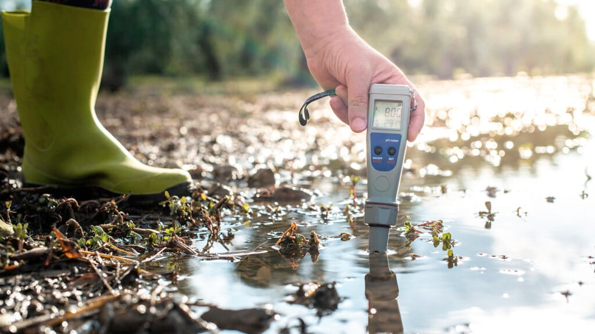

-->

### Experimentos y resultados

Los sensores se encargan de convertir una medida física como temperatura, pH o presión atmosférica (por ejemplo) a una corriente o voltaje interpretable por un circuito electrónico.

La calidad de los datos generados depende directamente de los sensores, y esto que afecta el desempeño del sistema y la calidad de información presentada a los usuarios. Por esto los sensores a utilizar son de vital importancia pero mejores sensores implican un mayor precio, y el objetivo del proyecto es generar un sistema de bajo costo.

Al entender mejor el comportamiento de los sensores y acotando y definiendo sus alcances se busca generar un óptimo equilibrio entre costo de los equipos y desempeños esperados del sistema Muchas veces equipos industriales o profesionales dan mayor precisión de la necesaria para análisis de dinámicas y anomalías de acuíferos (considerando una holgura) y ello es calidad perdida, cuyo valor económico se podría ahora o aprovechar en otras partes del problema.

En la siguiente tabla encontramos los sensores en proceso de pruebas para medir 5 variables fisicoquímicas relevantes:

| Variable | Modelo Sensor | Rango | Error |
| - | - | - | - |
| Tº | - [DS18B20](https://altronics.cl/sensor-sonda-temperatura-ds18b20?search=ds18b20)  | \-10°C - 85°C | ±0.5 ºC |
| Presión  | - [HK1100C](https://altronics.cl/sensor-presion-hk1100c)   - [Gravity Pressure](https://www.dfrobot.com/product-1675.html)| 0 - 1,2 MPa | 1.5% |
| pH | - [Gravity: Analog pH Sensor/Meter](https://www.dfrobot.com/product-1025.html)  | 0 - 14 pH | ±0,1 pH |
| Conductividad Eléctrica | - [Gravity: Analog TDS Sensor/Meter](https://www.dfrobot.com/product-1662.html)   -[Grove - TDS Sensor/Meter](https://www.seeedstudio.com/Grove-TDS-Sensor-p-4400.html)| 0 - 1000ppm 0 - 2000 uS/cm | ± 10% FS 200 uS/cm 0.2 mS/cm |
| Turbiedad | - [Grove - Turbidity Sensor/Meter](https://www.dfrobot.com/product-1394.html)   - [Sensor turbidez](https://altronics.cl/sensor-turbidez-liquidos) | 0 - 3000 NTU | No indica |

Se somete a los sensores a tipos de pruebas que permitieran evaluar dos dimensiones principales de su comportamiento: (1) su presición y (2) su desempeño por periodos prolongados de sumersión en medio acuático, este último escenario permitirá entender el 'sensor drift' o descalibración de los equipos.

Para esto se utilizó baldes de agua en condicinoes controladas que simulan las condiciones en un acuífero y un sistema de captura de datos para luego procesarlos. El resumen de los experimentos actuales puede verse en la siguiente tabla a continuación.

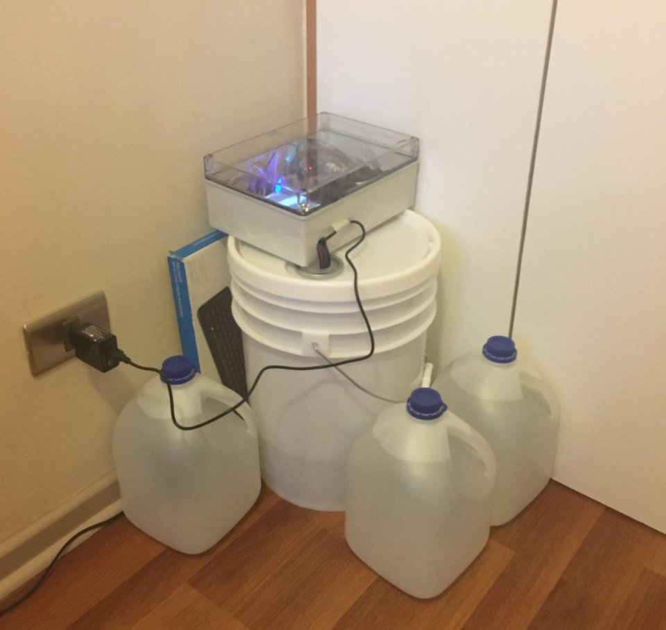
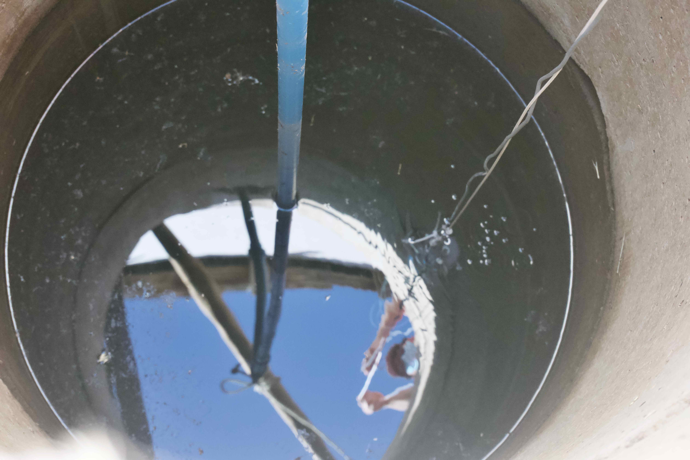

| Variable                   | Estado | Comentario |
| -------------------------- | ------ | ----------- |
| Temperatura | ✅ Aprobado para proseguir experimentos | Operación dentro de lo esperado. Error menor a 0.5 ºC y buen desempeño en sumersión continua |
| Presión     | ✅ Aprobado para proseguir experimentos | Operación dentro de lo esperado. Error menor a 1cm y buen desempeño en sumersión continua |
| pH          | ✅ Aprobado para proseguir experimentos | Operación dentro de lo esperado. Error menor a 1 y buen desempeño en sumersión continua |
| Conductividad Eléctrica | ⚠️ En evaluación | Buena calidad de medición pero presentó problemas en sumersión continua. Se realizarán nuevos experimentos |
| Turbiedad   | ❌ Reprobado | Error muy alto (mayor a 1000 TPU) y sensor muy sensible a variables externas |

<b> * Más detalles sobre los experimentos en el repositorio del proyecto </b>

### Siguientes pasos

...

<!--
#### Algunos detalles

Algunos comentarios sobre los diferentes sensores:
##### - Temperatura:

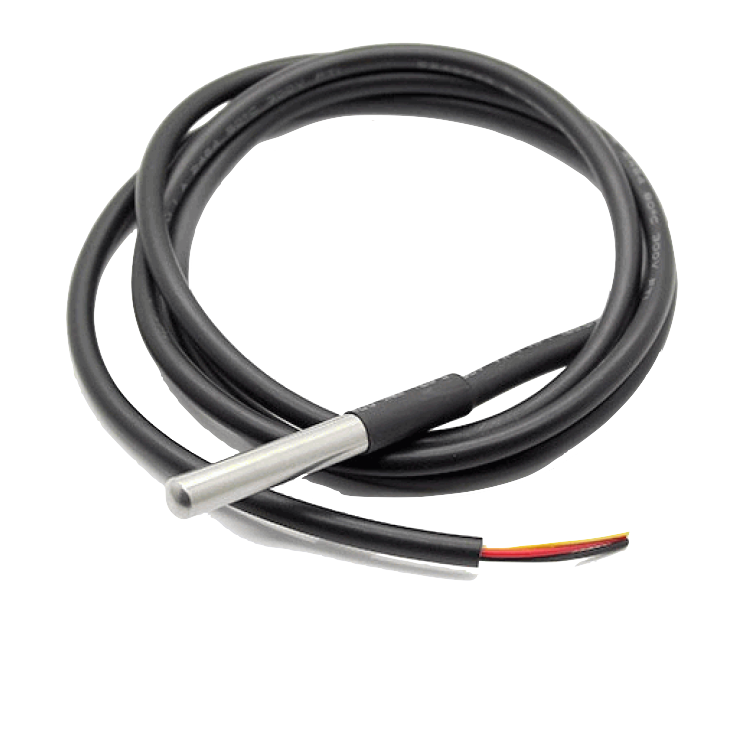

Experimentos demostraron un buen desempeño del sensor en su comportamiento en el tiempo. Algunas observaciones:

- Comportamiento muy predecible, después de un tiempo se puede observar una muy leve desviación lineal constante de la medidas, pero se puede corregir completamente reajustando un offset.
- Errores menores a 0.5ºC luego de 2 meses  de uso prolongado sin recalibrar. Luego de 9 meses de uso error en mediciones aumento pero se mantiene menor a los 0.5ºC al recalibrar. 

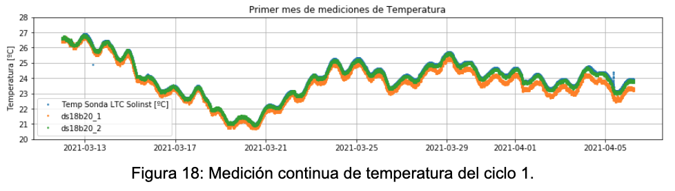

##### - Conductividad:

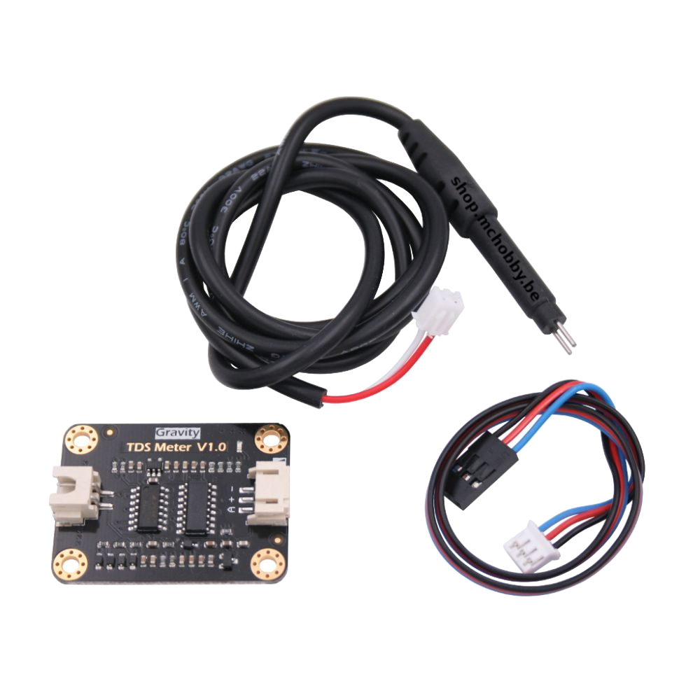

Algunas observaciones:

- Al medir dos al mismo tiempo se afectan la medida.
- Es súper clara la medición dentro del rango de 0 - 1500 uS/cm.
    - Al medir hasta 1500 uS/cm errores se mantienen bajo los 50 uS/cm. Al medir hasta 2000 uS/cm error medio se mantiene entre 100 - 200 uS/cm.

- Luego de 3 meses de uso continuo, sensor pierde su calibración Se esperan más experimentos para ver si es por depositos de minerales en el sensor, o si es corregible, o fue un error puntual, o etc.
- No se ve histéresis importante.

##### - pH:

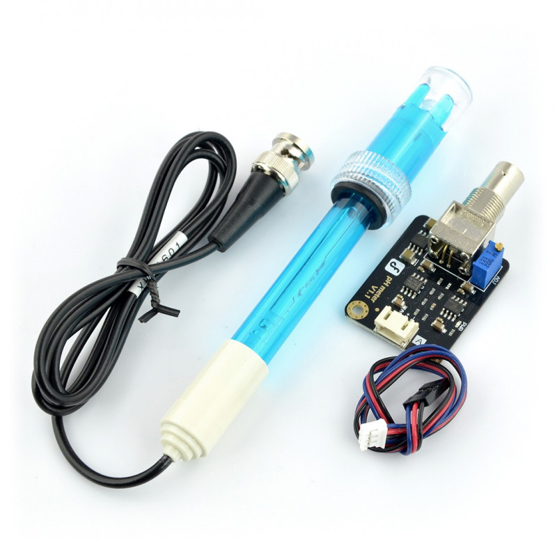

- No se ve mucha histéresis. Hay harta variación en la calibración pero al recalibrar los sensores vuelven a funcionar.
- Se esperar hacer más experimento para corroborar datos y además poder ir estimando que tan rápido se descalibran los datos, y cuánto se va perdiendo de presición con cada recalibración.

##### - Nivel de Agua:

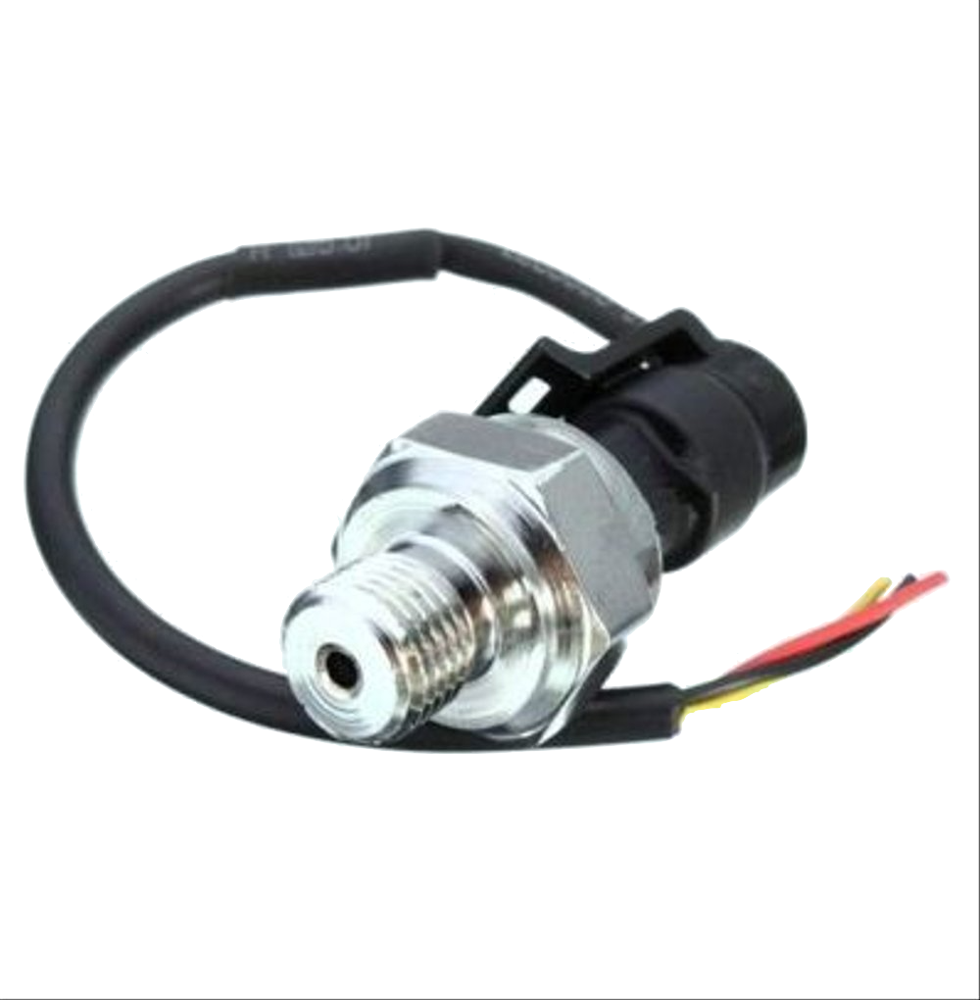
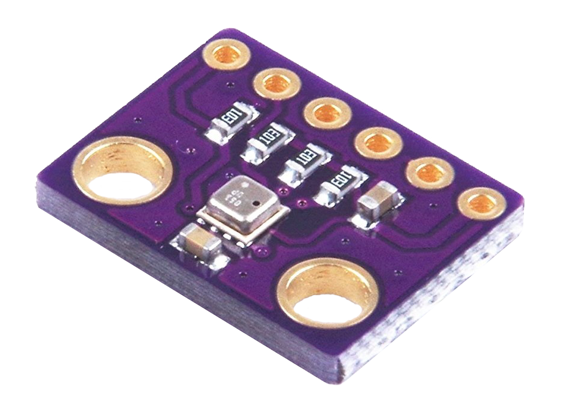

- Para medir el nivel de una columna de agua se usan dos sensores: uno en el fondo del pozo y otro en la superficie para corregir las variaciones en la presión atmosférica que también siente el sensor sumergido. 
- Experimentos fueron positivos, el error de medición fue menor a 1 cm en diferentes experimentos y luego de 3 meses de medición continua equipo sigue midiendo correctamente, no se observa desviación en su medición.

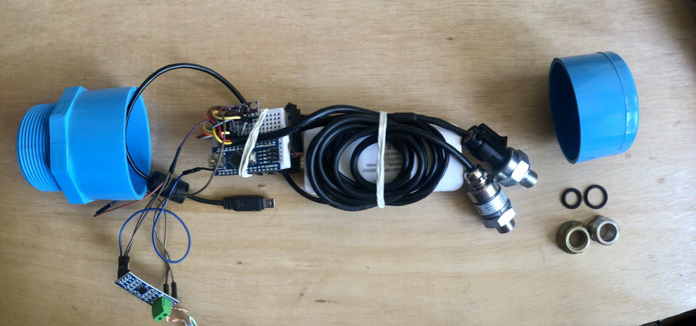
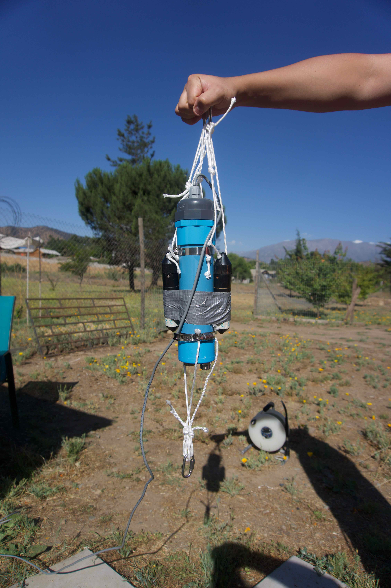

##### - Turbidez:

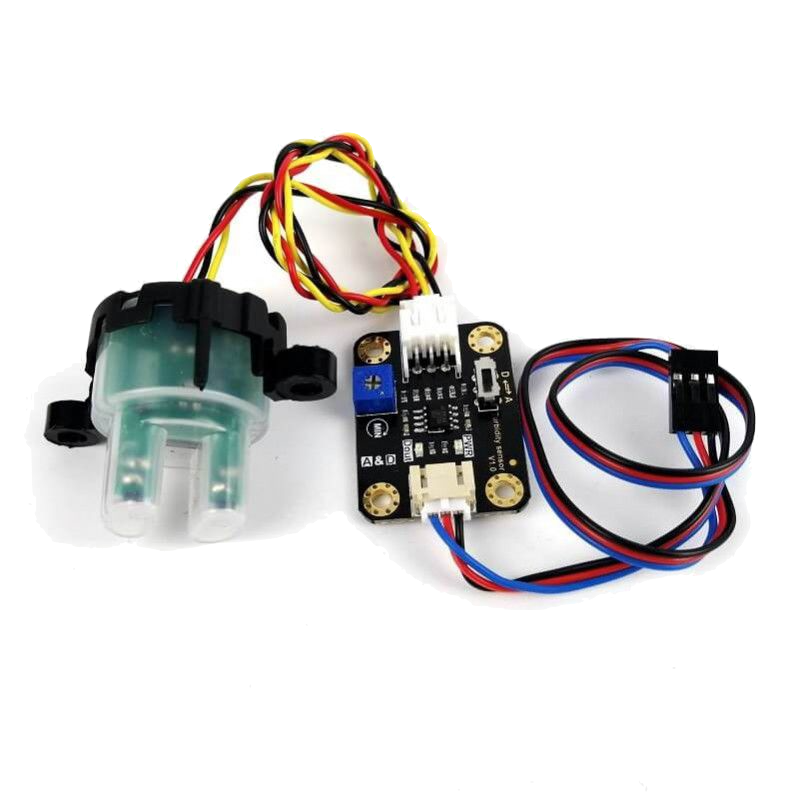

- Sensores son muy sensibles a la luz, entonces mediciones varían ampliamente dependiendo de la luz ambiente y la posición en que se coloquen, cualquier movivmiento o cambio de alguna de estas condiciones afectará la medición.
- Errores del rango de ~1000 NTU. No confiables, quizás solo apra alertas grandes pero mejor seguir buscando.
-->

<!--
## Aprendizajes
- tener un buen setup del experimento
-->