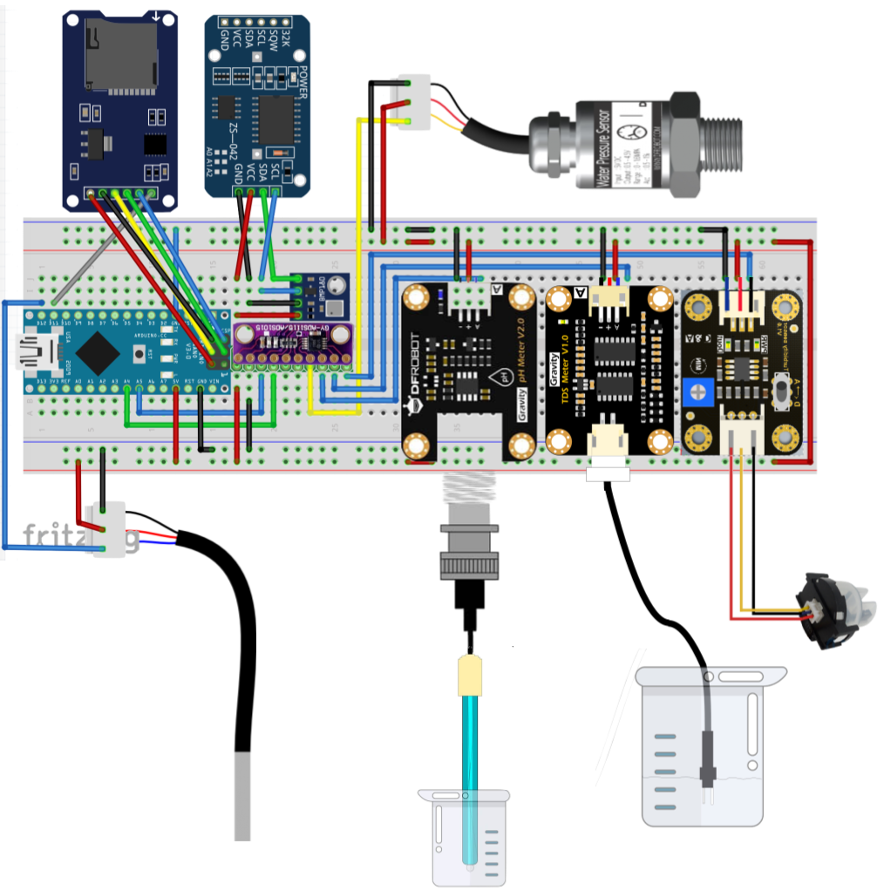
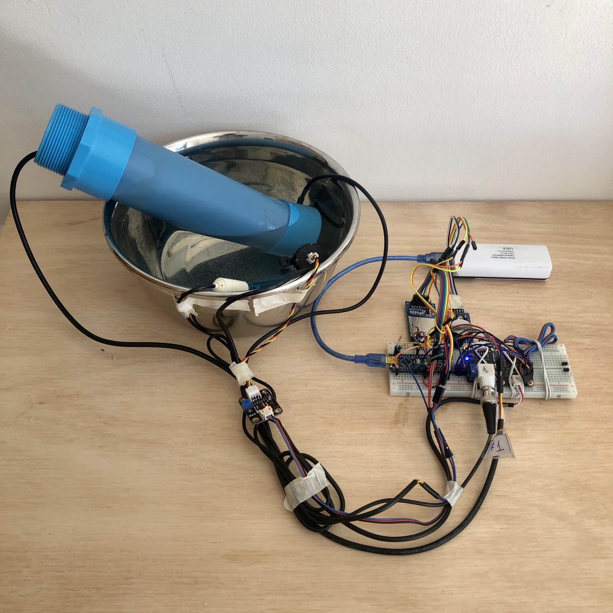
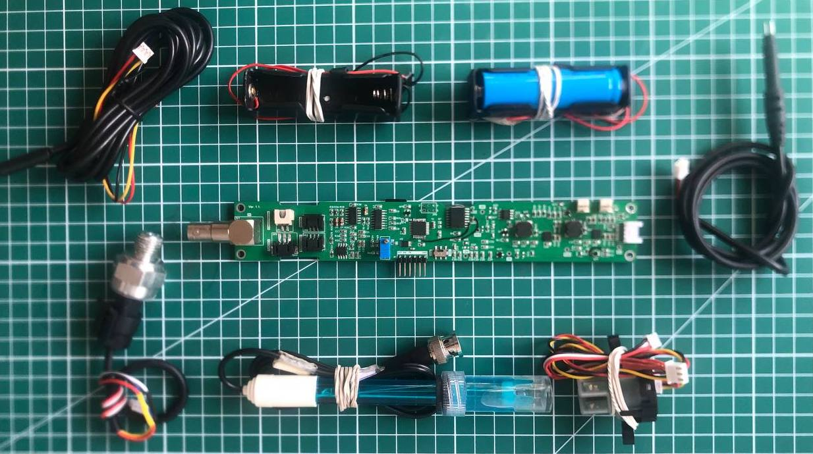
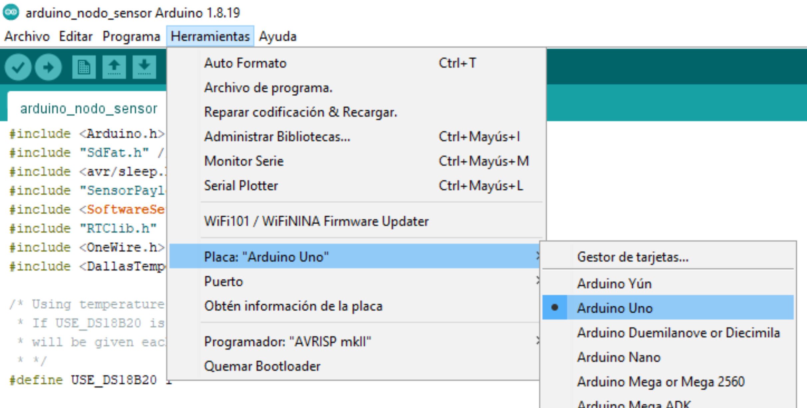

# 💻 Electrónica

### Diseño

La electrónica se encarga de obtener las señales eléctricas o datos de los sensores, almacenarlos, comunicarlos y realizar todas las tareas y mecanismos necesarios para garantizar que la toma  y comunicación de datos funcione en los momentos, tiempos y cantidad esperados.

En este trabajo los sensores se utilizan en experimentos de calidad, pruebas de comunicación y en prototipado, entre otros, por lo que se diseñaron diferentes electrónicas para los diferentes usos internos. Pero por lo general tenían en común un esquema como el siguiente que cuenta con un reloj, una memoria y conexión de los diferentes sensores a un procesamiento:

Abajo se observa una implementación de este equema para pruebas de los sensores. El prototipo guarda los datos en una microSD y los comunica por puerto serial para verlos en tiempo real.

### Prototipado

Para le electrónica a sumergir bajo el agua se trabajó en la integración de todos los componentes en una PCB. Esta nueva placa debe tener el tamaño y funcionalidades suficientes para ser sumergida junto a la carcasa diseñada en la sección [Carcasa](2-Carcasa.md).

Para otorgarle autonomía se suman dos nuevas funcionalidades:
1. **Fuente energética a baterías:** Agregar baterías de litio 18650 con electrónica correspondiente para un correcto funcionamiento (cargadores y elevadores).
2. **Distribución energética de componentes:** Dividir la fuente de energía en una que apaga los sensores cuando no están midiendo para reducir el consumo.

Se reviso factibilidad y detalles del proceso para fabricación de la placa, se vieron dos opciones principales:

1. Opción Externa: Fabricar y ensamblar en el extranjero
2. Opción Local: Fabricar placa en el extranjero y ensamblar componentes localmente.

<!-- La segunda opción implica hacer el trabajo de comprar todos los componentes de la placa y soldarlos. Sus ventajas son la posible reutilización de componentes dificiles de encontrar desde la electrónica original de los sensores y una consecuente optimización de costos. -->

Ambas opciones tiene un costo cercano a los 200 dolares americanos por placa. Puede ser importante evaluar la disponibilidad de componentes para decidir por una opción.

**Importante:** Considerar además un precio extra en cuando a sensores y baterías del dispositivo de $100.92USD/unidad aprox.

<!--
|   Cotizaciones  | **Total (5u)** | **Total+ 30%*** | **Precio unitario USD** | **Tiempo**  |
|-----------------------------|----------------|----------------|---------------------|-------------|
| **Opción Local**                   | $772.09        | $1003.72       | $200.74             | 3-4 semanas |
| **Opción Externa EEcart**          | $907.26        | $1179.44       | $235.89             | 5 semanas   |
| **Opción Externa PCBWay**          | $888.45        | $1176.19       | $231.00             | 5.5 semanas |
-->

### Uso y programación

Para utilizar la placa considerar los siguientes materiales:

1. Componentes externos
    a.  Baterías 18650
    b.  Tarjeta SD
    c.  Pila Reloj
2. Para programar
    a. Cable de energía
    b. Cable de programación (FTDI)
3. Sensores

Para programar la placa considerar los sigueintes pasos generales:

1. PCB debe estar alimentada por batería o cable de energía.
2. Conectar un **adaptador FTDI-USB** en el puerto FTDI de la PCB por un lado y en puerto USB del computador por el otro.
3. Dejar el **interruptor en FTDI** (se encuentra al lado de conexión a programador).

La programación se realiza en Arduino IDE y el programa se encuentra en el siguiente [enlace](https://github.com/niclabs/water-monitoring/tree/master/6.%20Electr%C3%B3nica/PCB-MCI/Codigo_Final). Para cargar el programa continuar con los pasos:

4. Seleccionar **el puerto** de conexión correspondiente en la pestaña herramientas.
5. Seleccionar  **Arduino Uno** en la pestaña herramientas.

6. Presionar "Subir código".

### Siguientes pasos

#### To Do's
_\*(Sección WIP matías)\*_

1. Disminuir costo de fabricación.
2. Mejorar autonomía del sistema.
