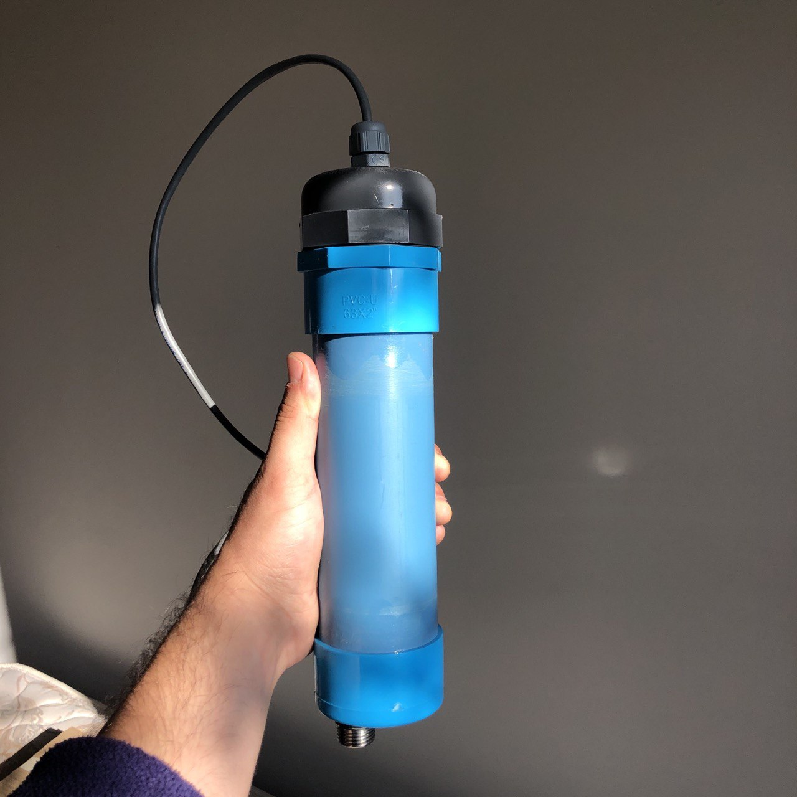
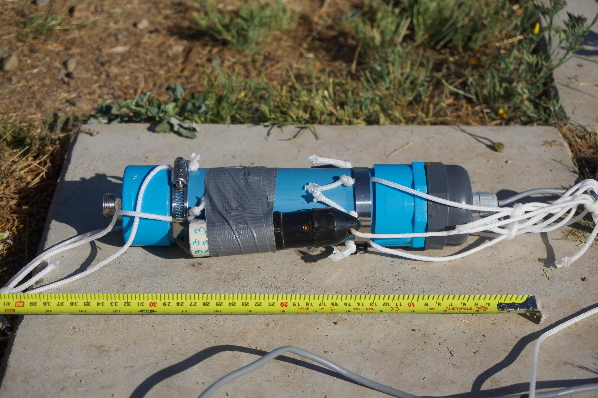
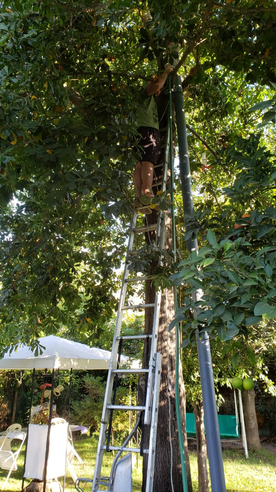
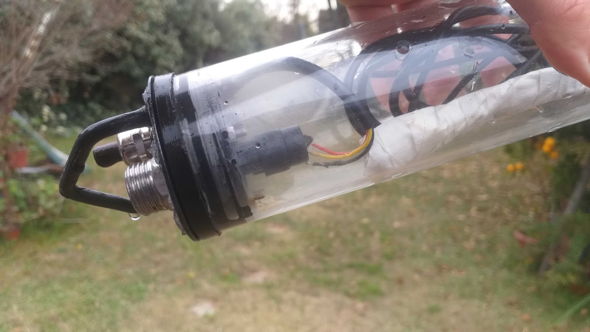
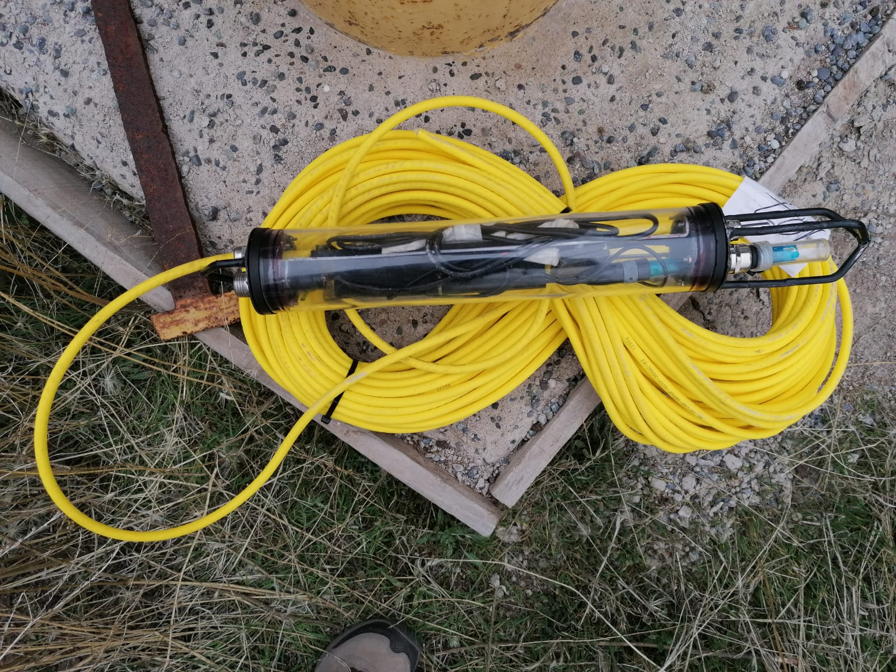
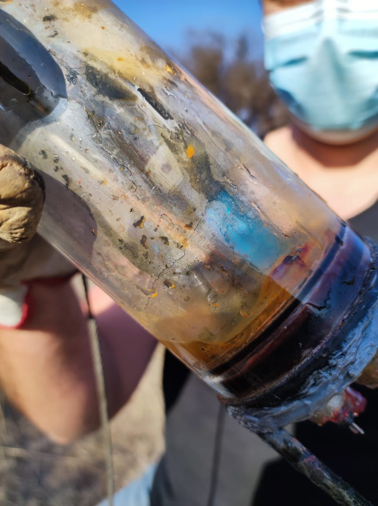
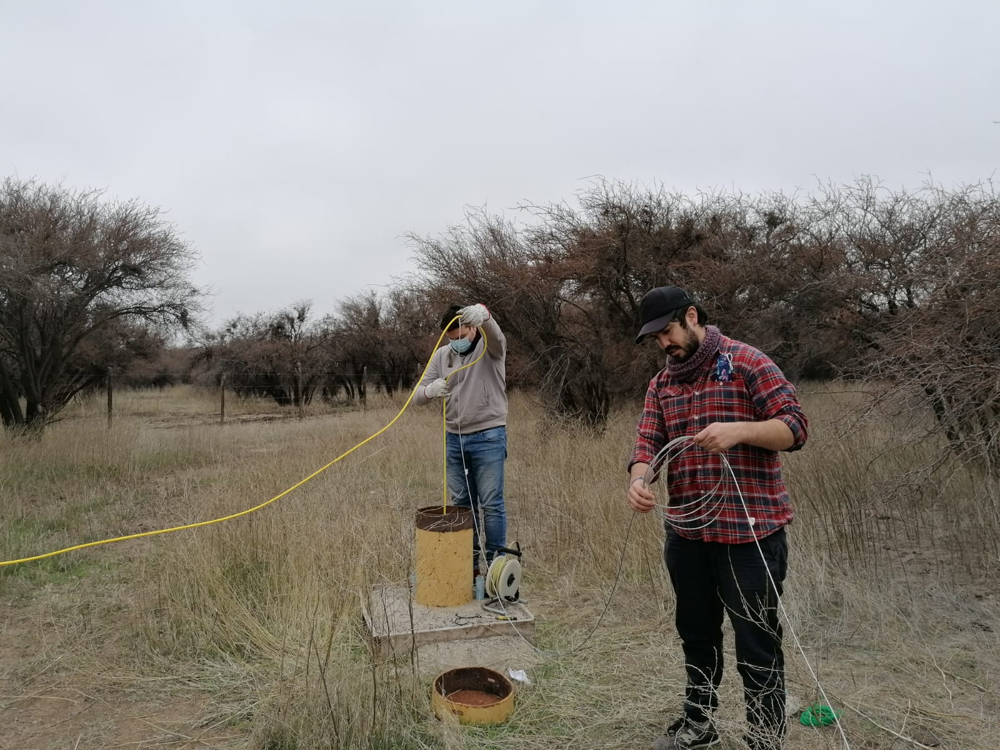
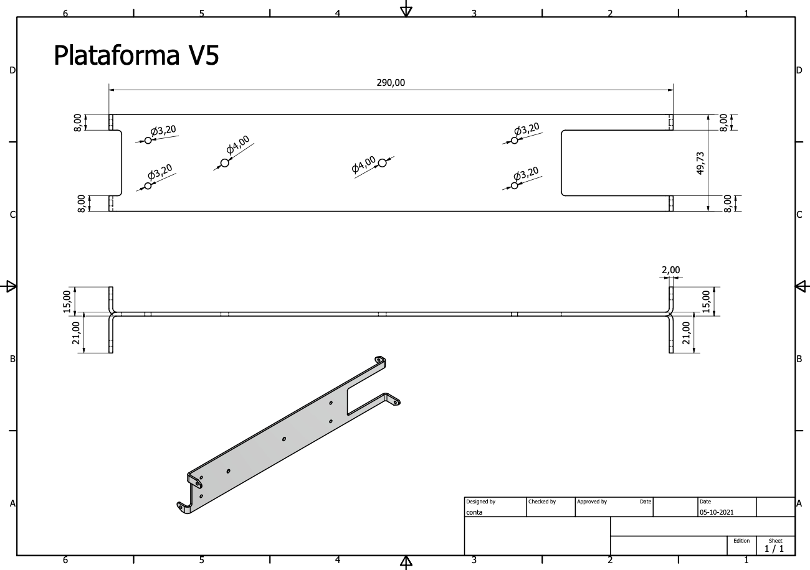
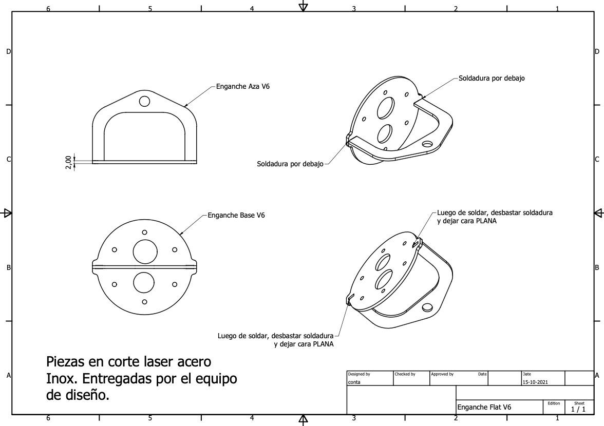
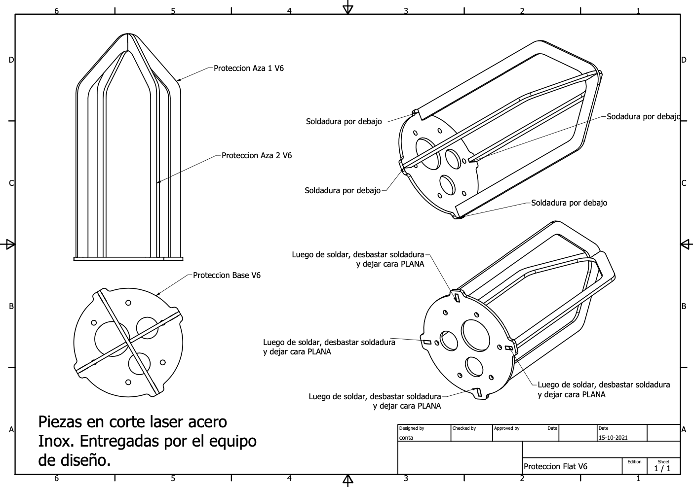

<!--

-->

# 📦 Carcasa sumergible

### Prototipado y pruebas

A continuación detalles sobre el diseño y construcción de la carcasa sumergible del sistema en su versión actual. Se han realizado pruebas en ambiente controlado (laboratorio) sumergiendo la carcasa en tanques de agua por diferentes períodos de tiempo y evaluando efectividad en la protección del interior de acuerdo al grado de protección IP alcanzado (norma internacional CEI 60529 Degrees of Protection).

Se fabricó un primer prototipo para realizar pruebas con los sensores de presión (nivel de agua) para sumergirlos en un pozo de unos ~5 metros. Se usaron materiales de plomería genéricos y se rellenó con arroz para absorver la humedad en caso de filtraciones.

Este prototipo estuvo sumergido unos 45 minutos y al sacarlo si tenía bastante humedad dentro, pero no tenía un "pozo de agua", la humedad si era suficiente para que en el tiempo dañara la electrónica. Se cree que las filtraciones fueron por las tapas de los sensores de presión.xzx

Se comenzó a diseñar una nueva versión de la carcasa, ahora sumando los requerimientos de priorizar materiales accesibles y disponibles en el mercado local. La geometría inicial contempla un tubo de acrílico transparente, tapas y un soporte interno para la electrónica, además de espacios laterales para la salida de los sensores y cable UTP. Las tapas laterales realizan el sello total del dispositivo en esta versión, mediante o'rings y fijándose al soporte interno que es lo que mantendrá las tapas a presión dentro del sistema generando la protección deseada IP69.

Se realizaron diferentes pruebas del nuevo prototipo, tanto a los componentes de sello de los sensores como al equipo completo en un ambiente controlado compuesto de un tubo de pvc de 6 metros de alto para simular la presión de una columna de agua.

Finalmente luego de algunas iteraciones se logro un sistema sin filtraciones como observado en la foto de abajo :).

Se probó este ptototipo luego en un pozo en el sector de Laguna Caren, aquí se realizaron pruebas sumergiendolo a mayores profundidades progresivamente (10, 20, 30 y 40mt).

Hubo de todos los resultados, positivos donde el permanecio sumergido sin filtraciones y también con filtraciones. Se observan algunos casos de carcasa con filtraciones más abajo.

### Archivos de diseño y fabricación

Se pueden encontrar los archivos de diseño, materiales e instrucciones en el siguiente link.

https://github.com/niclabs/water-monitoring/tree/master/5.%20Hito%20Carcasa

### Siguientes pasos
_\*(WIP matías)\*_
_\*TODO: agregar información sobre la manguera\*_
_\*TODO: agregar información sobre tipo de ambiente para diseñar la carcasa (requerimiento)\*_

Se puede ordenar el trabajo futuro en dos categorías dependiendo de su objetivo:

##### To Do's:

1. Disminución de costo de materiales.
2. Estandarización de proceso de fabricación.

##### To Fix:

1. Revisar mecanismo de sellado y filtraciones.

<!--

- mayores dificultades, tipos de pruebas, desafíos.

Diseño final y partes

## Instrucciones armado

Manual (Adjunto)

## Resultados pruebas

Método de las pruebas

pruebas en tubo rancagua

pruebas en terreno

pruebas antes de llevar a terreno

Resumen de resultados y roadmap siguiente.

Comparación de costos cable vs cable nosotros.

- Tips
- Consejos
- Desafíos

Aprendizajes.

-->
