<h1 style="text-align:center;color:#000610">💧 Fondef IDeA ID19I10363: Open Water</h1>

<h5 style="text-align:center;color:DodgerBlue;"> Sistema abierto experto para apoyar la gestión de recursos hídricos mediante monitoreo de bajo costo en tiempo real de aguas superficiales y subterráneas </h5>

En enero del 2020, bajo el marco del proyecto FONDEF IDeA ID19I10363, se unieron el NIC Chile Research Labs, el Departamento de Ingeniería Eléctrica y el Departamento de Geología de la Universidad de Chile, junto con las entidades asociadas Arcadis SPA, University of Illinois at Urbana-Champaign, Esval y la Dirección General de Aguas para proponer diseñar y desarrollar un prototipo experimental con el objetivo de lograr tener un sistema de medición multiparamétrico abierto, con el cual se pueda masificar el monitoreo de la calidad de agua tanto superficial como subterranea, con la adaptación de la tecnología de bajo costo.

La investigación científica es llevada a desarrollo mediante fondos otorgados por FONDEF ID19I10363.

[
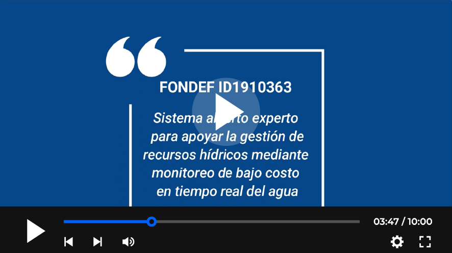
](https://www.youtube.com/watch?v=SJs9-OBhGeA)

Este sitio constituye un esfuerzo por documentar las consideraciones de diseño, avances y logros obtenidos para las diferentes áreas de trabajo. Se divide la estructura en las siguientes secciones:

1. [🌡 Sensores](0-Sensores.md)
2. [💻 Electrónica](1-Electrónica.md)
3. [📦 Carcasa sumergible](2-Carcasa.md)
4. [📡 Comunicación inalámbrica](3-Comunicación-inalámbrica.md)
5. [🤖 Sistema experto](4-Sistema%20Experto.md)

<!--
## Noticias

##### 05.05.2022 - Bitácora Niclabs
[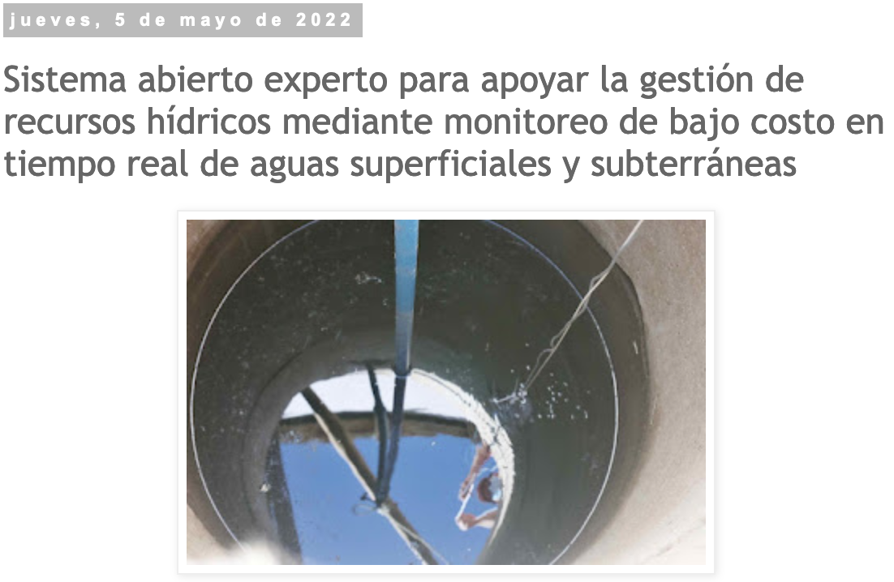](https://www.youtube.com/watch?v=SJs9-OBhGeA)
-->

## Equipo

[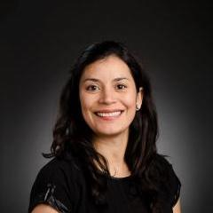](https://www.linkedin.com/in/scespedes/)
[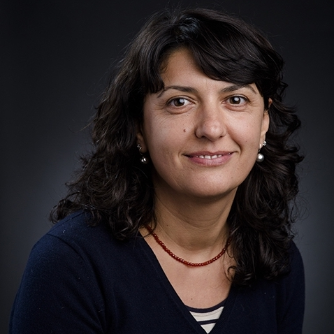](https://www.linkedin.com/in/linda-daniele-9a35bb39/)
[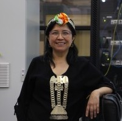](https://www.linkedin.com/in/doris-saez-ba2ab5146/)
[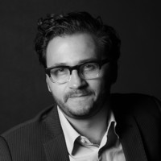](https://www.linkedin.com/in/juan-salamanca-8b784411/)
[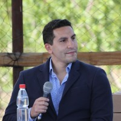](https://www.linkedin.com/in/matias-taucare-toro/)
[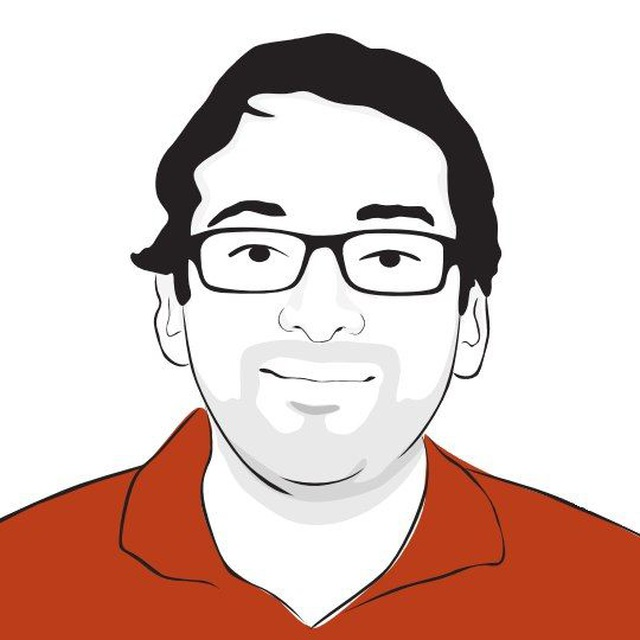](https://www.linkedin.com/in/francisco-jaramillo-montoya-0a6b8750/)
[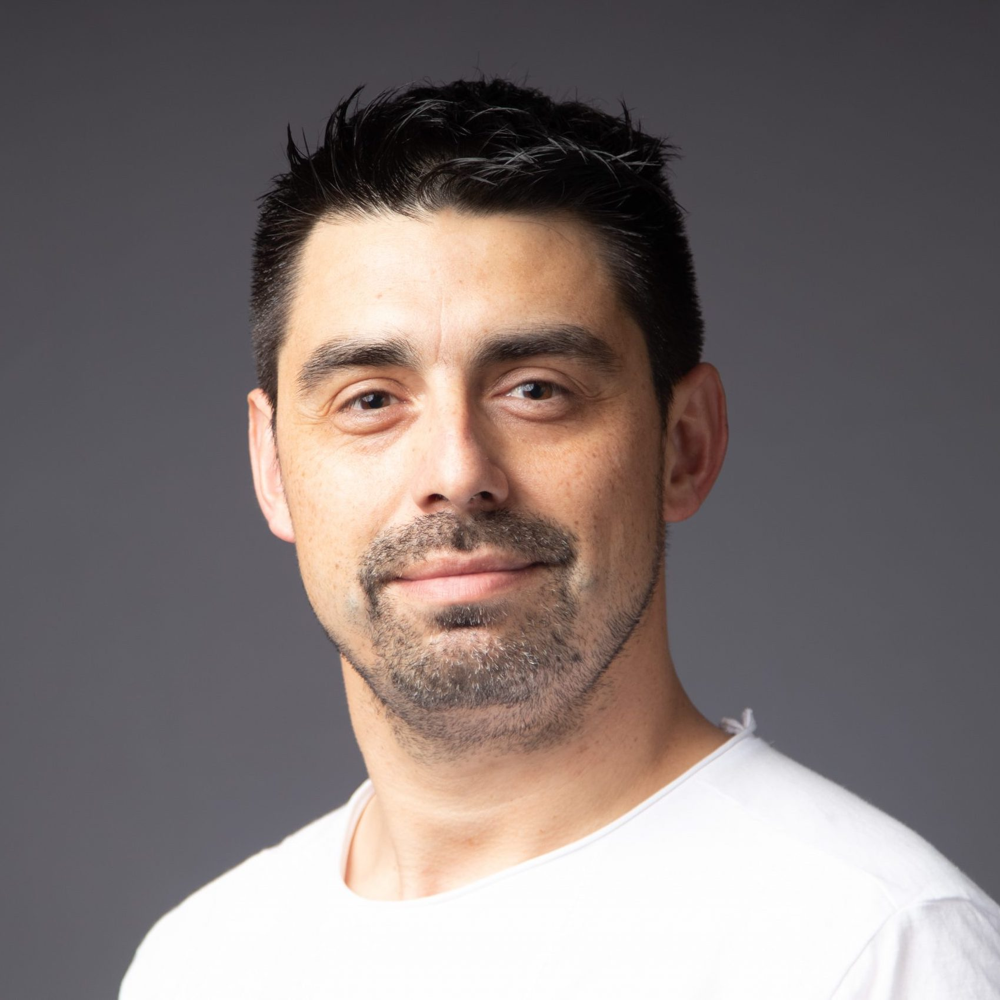](https://www.linkedin.com/in/rodrigomunozlara/)
[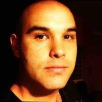](https://www.linkedin.com/in/pmartinchile/)
[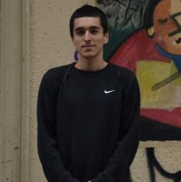](https://www.linkedin.com/in/sebcif)
[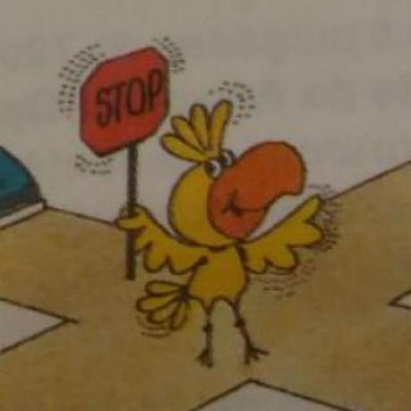](https://github.com/gaboflowers)
[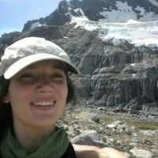](https://www.linkedin.com/in/gabriela-mendoza-muñoz-700945151/)
[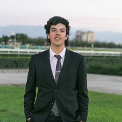](https://www.linkedin.com/in/maximiliano-jones-herrera-b4013b97/)
[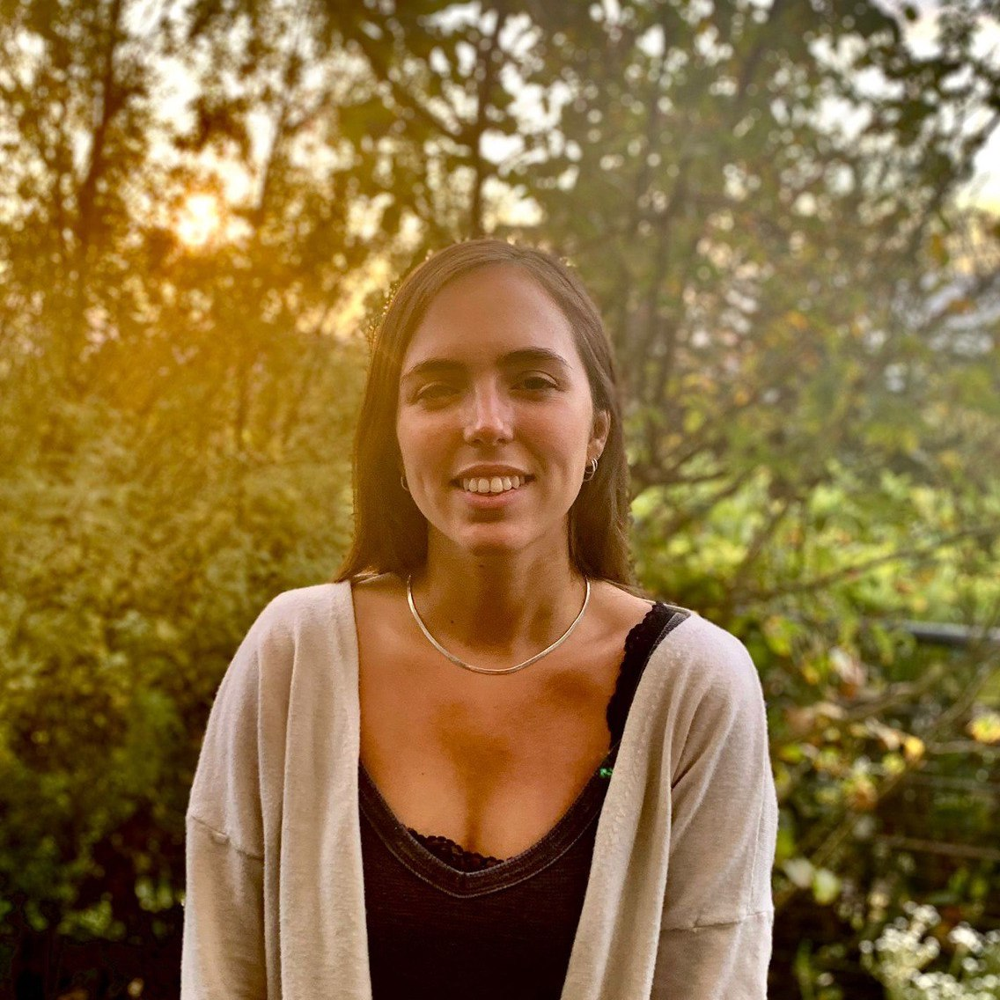]()
[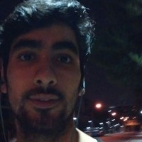](https://www.linkedin.com/in/amilcar-aravena/)
[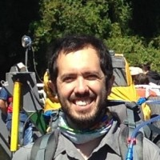](https://www.linkedin.com/in/matiasmacayaleiva/)

_*Presiona en su imagen para visitar su linkedin o sitio web_

## Licencia

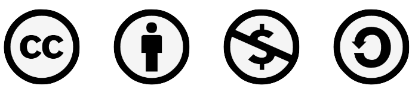

**CC BY-NC-SA 4.0**

**Attribution-NonCommercial_ShareAlike 4.0 International**

Open Water: Fondef IDeA ID19I10363 © 2022 by Universidad de Chile is licensed under CC BY-NC-SA 4.0. To view a copy of this license, visit http://creativecommons.org/licenses/by-nc-sa/4.0/

This license requires that reusers give credit to the creator. It allows reusers to distribute, remix, adapt, and build upon the material in any medium or format, for noncommercial purposes only. If others modify or adapt the material, they must license the modified material under identical terms.

## Contacto

Felices de escucharte, escribenos tus consultas, comentarios o si solo quieres decir hola, escribenos a:
[openwater@niclabs.cl](openwater@niclabs.cl)

<!--
BY: Credit must be given to you, the creator.
NC: Only noncommercial use of your work is permitted. Noncommercial means not primarily intended for or directed towards commercial advantage or monetary compensation.
SA: Adaptations must be shared under the same terms.
-->

<!--
<b>Editar bitacora</b>

Referirse a la página [como editar](old/como-editar.md).
-->
