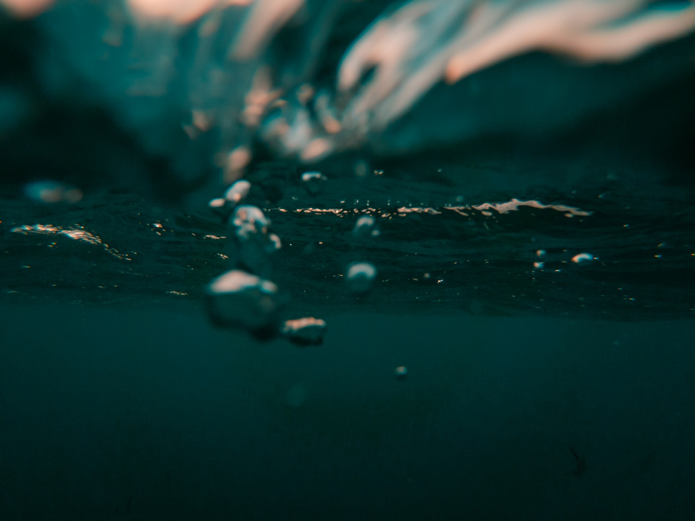

<!-- _coverpage.md -->

# Fondef IDeA ID19I10363: Open Water

> Sistema de bajo costo de medición y monitoreo de agua en tiempo real.

- Simple y de bajo costo
- Proyecto open hardware
- Para utilización en aguas superficiales y subterraneas

[GitHub](https://github.com/docsifyjs/docsify/)
[Get Started](#docsify)

<!-- background image -->

<!-- background color -->
