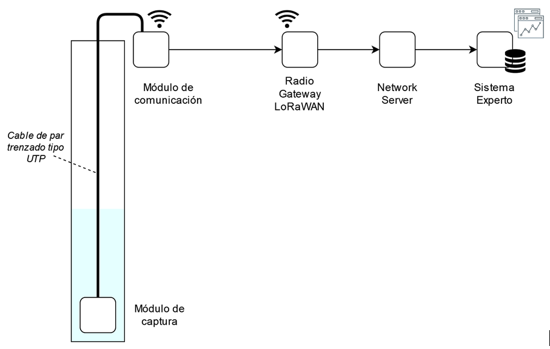
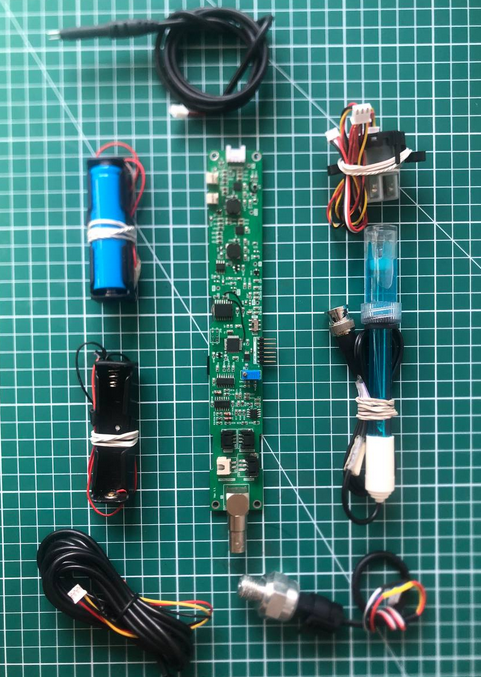
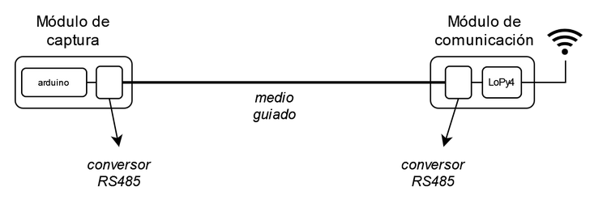
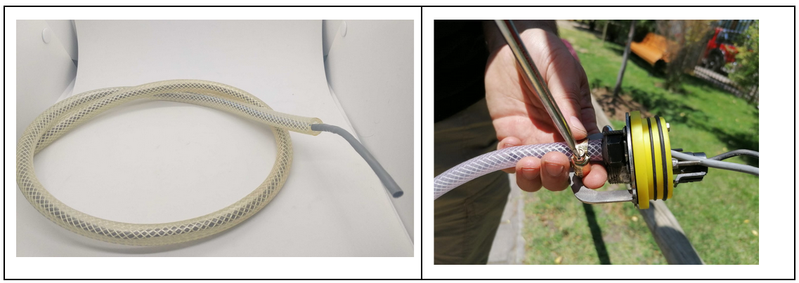
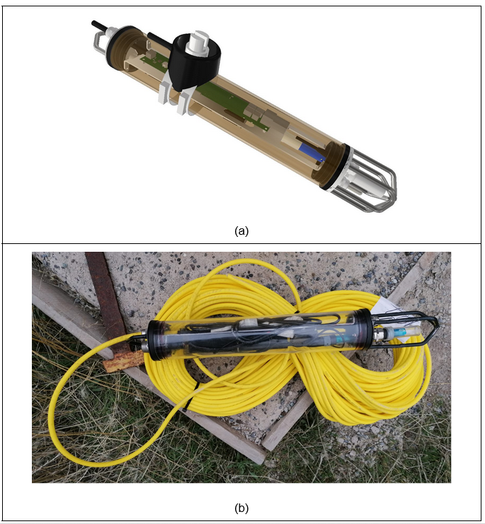
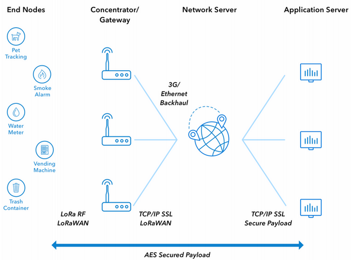
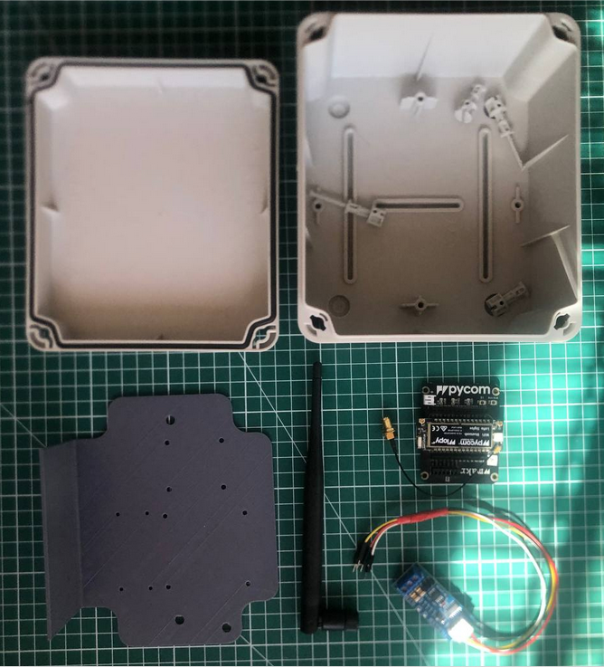
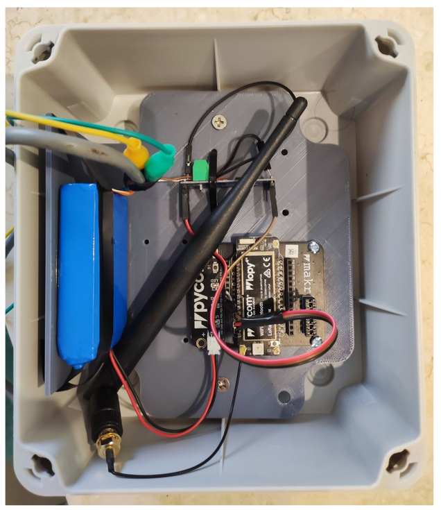
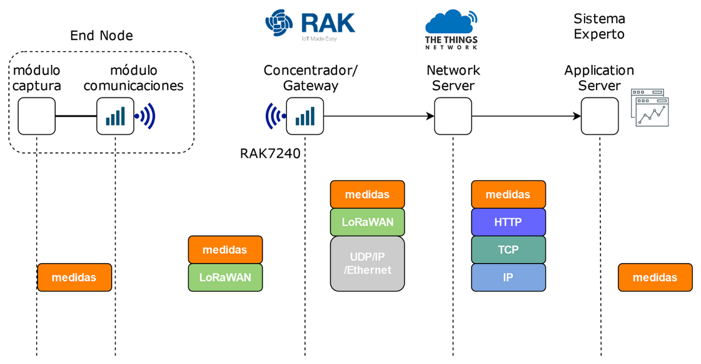

# Comunicación Inalámbrica

## Introducción
La figura 1 muestra el diagrama completo de conectividad de la solución. El sistema de comunicación a implementar utiliza un medio guiado para la comunicación entre el módulo de captura, ubicado en el fondo de la masa de agua y el módulo de comunicación, ubicado en la superficie. Se utiliza la tecnología LoRaWAN para la transmisión de datos entre el módulo de comunicación y el network server. Finalmente la comunicación entre el Network Server y el Sistema Experto es a través de tecnología Web utilizando el protocolo HTTP. Los datos de los sensores son almacenados en una Base de Datos para ser posteriormente procesados por el sistema experto.

Figura 1. Diagrama de bloques de la solución

## Nodo Sensor
### Módulo de Captura
El módulo de captura está compuesto por cuatro elementos:

 * Transductores (Presión, pH, Turbidez, Temperatura y Conductividad Eléctrica): Estos elementos son los encargados de convertir una medida física a una corriente o voltaje interpretable por un circuito electrónico.
 * Placa Electrónica o PCB: encargada del procesamiento de la información además del envío de ella hacia el módulo de comunicación ubicado en la superficie. Este módulo además cuenta con un reloj encargado de marcar las muestras con la hora de su captura.
 * Cable de par trenzado. Este cable es el encargado de transportar los datos entre el módulo de captura y el módulo de comunicación. Para ello se utiliza un cable UTP dentro de una manguera para evitar su corrosión.
 * Carcasa sumergible: Encargada de dar la protección necesaria para poder sumergir todos los elementos anteriores.

La figura 2 muestra una imagen de la placa electrónica y los transductores antes de ser ensamblados dentro de la carcasa sumergible. Esta placa incluye las funcionalidades de captura de datos de los transductores, envío de cada muestra hacia el módulo de comunicación. Cada muestra es estampada con la hora de captura más un indicativo del transductor que obtuvo la muestra.

Figura 2. Placa Electrónica junto a los transductores

El envío de datos desde el módulo de captura al módulo de comunicación es a través del protocolo serie RS485. Para ello ambos módulos cuentan con un conversor de protocolo de comunicación UART a RS485 como muestra la figura 3. El medio físico que une ambos módulos es un cable de par trenzado del tipo UTP (unshielded twisted pair). Para poder resistir el agua, el cable es recubierto con una manguera flexible (ver figura 4). En los extremos se utiliza un mecanismo para introducirlo a la carcasa sumergible.

Figura 3. Diagrama de bloques para la comunicación entre módulos en el nodo sensor

Figura 4. Cable de datos UTP para la comunicación entre el módulo de captura y el módulo de comunicaciones.

La figura 5 muestra la carcasa sumergible. La carcasa está compuesta por un tubo central de acrílico de 3 pulgadas de diámetro interior y espesor de 3 mm, más dos piezas de ajuste (con sus respectivas tapas) y 3 o'rings de sellado. Las piezas que reciben los orings se han realizado en un proceso de torneado de Technyl debido a su universalidad, las tapas por otro lado, se han cortado en un proceso láser cnc por su bajo coste y precisión.

figura 5. Carcasa Sumergible. (a) imagen renderizada de la carcasa 3D completa, con el anclaje, sensores y placa electrónica. (b) Fotografía de la carcasa con anclaje y sensores.

### Módulo de Comunicación

El módulo de comunicación está compuesto por 2 elementos:

 * submódulo LoPy4: encargado del procesamiento de la información serial proveniente del módulo de captura. Además tiene la responsabilidad de enviar las medidas a través del canal inalámbrico utilizando tecnología LoRaWAN.
 * submódulo RS-485: encargado de convertir la comunicación serial RS-485 proveniente del módulo de captura a estándar UART para que pueda ser procesada por el submódulo LoPy4.

Para poder realizar la implementación se considera el diagrama de una red LPWA (Low Power Wide Area) definida en *[1]*, el cual considera cuatro bloques: End-Nodes, Concentrado/Gateway, Network Server y Application Server tal como lo muestra la figura 6. El módulo de comunicación del nodo sensor representa a un End-Node en la arquitectura LPWA.

Figura 6. Arquitectura LoRaWAN. Tomada de [1].

El nodo LoPy4 es una placa de desarrollo que soporta cuatro tipos de red (LoRa, Sigfox, WiFi, Bluetooth). Además implementa MicroPython, una versión eficiente del lenguaje de programación Python 3 que incluye un pequeño subconjunto de la biblioteca estándar de Python y está optimizado para ejecutarse en microcontroladores y en entornos restringidos, como el microcontrolador ESP32. La figura 7 muestra el módulo de comunicación antes de ser ensamblado. La figura 8 muestra el módulo de comunicación ensamblado.

Figura 7. Módulo de Comunicaciones con todas sus partes (antes de ser ensamblado)

Figura 8. Módulo de Comunicaciones con todas sus partes (después de ser ensamblado)

## Red LPWA

Como se indicó en la sección anterior, el módulo de comunicación del nodo sensor, cumple el rol de End-node en una red LoRaWAN (ver figura 6). Los otros componentes de la red son implementados de la siguiente manera:

 * El Concentrador o Gateway: este elemento es desplegado utilizando un Radio Gateway marca RAK modelo 7240.
 * El Network Server: es implementado a través del proyecto opensource The Things Network (https://www.thethingsnetwork.org/). Este proyecto permite crear aplicaciones que reciben los mensajes LoRaWAN provenientes desde los End-Nodes y los reenvia hacia un Application Server, que en nuestro caso es el Sistema Experto.

## Sistema Experto
El sistema experto representa al Application Server de una arquitectura LoRaWAN (ver figura 6). Luego que los mensajes LoRaWAN son recibidos por el Network Server, son enviados al Sistema Experto a través de mensajes HTTP. El flujo de mensajes se describe en la figura 9.

Figura 9. Flujo de mensajes entre el módulo de captura y el Sistema Experto

El sistema experto procesa los mensajes HTTP y extrae las medidas provenientes de un nodo sensor. Luego, por cada medida obtenida, se almacena en la base de datos los siguientes datos:

 * ID del nodo sensor
 * ID del transductor
 * Marca de tiempo en la que se realizó la medida
 * Valor de la medida

----

[1] http://thethingsnetwork.org/docs/lorawan/architecture.html
